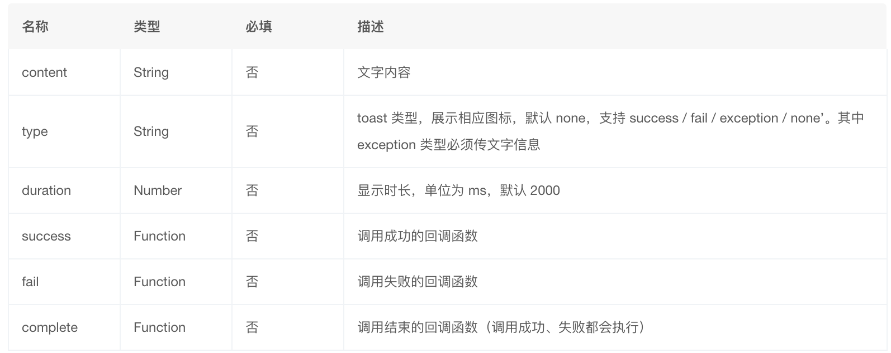
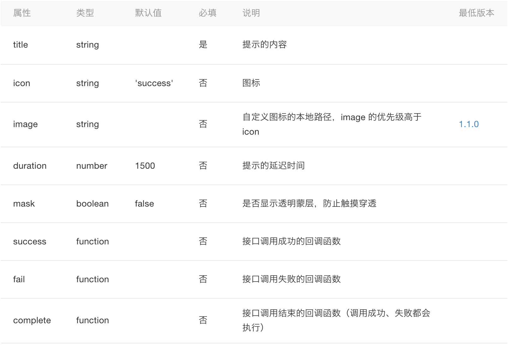

# 特定平台代码

当开发者面对产品需求需要同时去支持多个不同平台的时候，我们期望的理想目标是一份代码可以同时跑在不同的平台上，对于开发者来说这是最美妙的事情，可以给开发者减少不少开发和维护成本。但现实是由于平台差异，主要包括组件、样式和 API 差异，导致很难达到这样一个理想目标。此外也有一些情况是属于产品需求带来的差异性，比如同一个产品可能 PM 要求在微信上加一个社交属性的功能，其它平台不需要。

`okam` 虽然尽量在抹平不同平台间的差异，但在某个阶段可能还很难或者做不到完全抹平，为了能让开发者撰写不同平台间的差异代码，`okam` 针对 `配置`、`脚本`、`模板`、`样式`、`组件`、`API` 提供了相应的机制来撰写特定平台代码。

## App 类型

目前支持的 App 类型（平台） `appType` 主要支持如下几种：

* `swan`: 百度小程序
* `wx`: 微信小程序
* `ant`: 支付宝小程序
* `tt`: 头条小程序
* `quick`: 快应用

下述文档中，如有提及 `appType` 默认情况下指代的都是这里罗列出来的 `appType`，对此不再赘述。

## 配置

目前 `okam` 支持了多个平台的小程序包括快应用开发，如果期望同一份代码在不同平台上运行，由于不同平台在应用配置上存在差异，尤其快应用跟其它小程序的配置上差异比较大。为了定义不同平台的配置，可以使用框架提供的私有环境属性 `_${appType}Env` 来定义特定平台的配置，甚至重写已有的一些配置定义。

以下述 app config 为例子，`_quickEnv` 是针对 `快应用` 增加的特殊配置：

* 如果构建的是 非快应用，该配置项会被忽略（删除）
* 如果构建的是 `快应用`，会先将 `_quickEnv` 里定义的值跟外部的配置做 merge，注意对于 `windows` 配置项比较特殊，会做对象值 merge，而不是值直接覆盖。此外，对于第一层属性值为 `null` 以及 `windows` 配置属性里值为 null 属性都会被删除。

```javascript
{
    window: {
        enablePullDownRefresh: false,
        navigationBarTextStyle: 'white',
        backgroundColor: '#211E2E'
    },
    networkTimeout: {
        request: 30000
    },
    _quickEnv: {
        window: {
            enablePullDownRefresh: null, // 删除 该属性
            menu: true
        },
        networkTimeout: null, // 删除 networkTimeout 属性
        package: 'com.okam.demo',
        name: 'okam-quick',
        versionCode: '1',
        icon: '/common/img/logo.png'
    }
}
```

经过处理后的 app config 将变成如下结构：
```javascript
{
    window: {
        navigationBarTextStyle: 'white',
        backgroundColor: '#211E2E',
        menu: true
    },
    package: 'com.okam.demo',
    name: 'okam-quick',
    versionCode: '1',
    icon: '/common/img/logo.png'
}
```

上述处理只是第一步处理，后续还会再基于快应用转换规则，再对上述配置再做二次转换，具体可以参考[快应用 App 配置](app/entry#快应用配置)。

## 脚本

为了开发针对不同平台的脚本逻辑，可以使用环境变量 `process.env.APP_TYPE` 进行判断，针对不同的 `appType` 做相应的逻辑处理：

```javascript

if (process.env.APP_TYPE === 'wx') {
    // 针对 微信小程序 处理逻辑
}
else if (process.env.APP_TYPE === 'swan') {
    // 针对 百度小程序 处理逻辑
}
// ...
```

经过构建处理，会自动将 `process.env.APP_TYPE` 替换成对应的要构建的目标 `appType` 常量。

## 模板

为了在模板里定义不同平台的视图模板结构，可以使用 `${appType}-env` 环境标签，该标签所起作用跟 `template` 类型，只是一个占位符，来包裹真实的模板代码。环境标签不可以互相嵌套，环境标签内部可以存在多个根节点。环境标签不支持任何属性定义包括指令使用。

```template
<template>
    <view class="home-page">
        <wx-env>
            <view class="wx-app-tip">
            欢迎使用微信小程序
            </view>
        </wx-env>
        <swan-env>
            <swan-spec-component></swan-spec-component>
        </swan-env>
    </view>
</template>
```

根据构建的目标 `appType` 会保留目标 `appType` 的环境标签，移除非当前 `appType` 的环境标签（整个节点移除）。对于当前构建目标的 `appType` 的环境标签，会将其环境标签的包裹节点移除掉。

假设当前的构建目标是微信小程序，则上述模板构建后的输出为：

```template
<template>
    <view class="home-page">
        <view class="wx-app-tip">
        欢迎使用微信小程序
        </view>
    </view>
</template>
```

## 样式

目前针对样式平台特定代码的撰写，支持两种方式：

* 平台前缀的属性定义
* 特定 `appType` 的媒介查询

### 平台前缀

如果只是微调不同平台的样式差异，可以通过给样式属性添加平台前缀方式增加特定平台样式：`-${appType}-xx`，比如微信小程序下的字体想调大些，可以按如下方式来撰写：

```css

.page-wrap .title {
    margin: 15px 0;
    color: #000;
    font-size: 12px; /* 默认使用的样式 */
    -wx-font-size: 14px; /* 针对微信微调下样式 */
}
```

如果构建的目标 `appType` 是非微信小程序，则会移除非当前目标 `appType` 前缀的样式属性定义。如果构建目标是微信小程序，则会保留当前目标 `appType` 前缀属性定义，经过转换后，会移除该 `appType` 前缀，并移除其覆盖的样式属性声明。

如果构建 `appType` 是非微信小程序，上述样式输出：

```css
.page-wrap .title {
    margin: 15px 0;
    color: #000;
    font-size: 12px; /* 默认使用的样式 */
}
```

如果构建 `appType` 是微信小程序，上述样式输出：

```css
.page-wrap .title {
    margin: 15px 0;
    color: #000;
    font-size: 14px; /* 针对微信微调下样式 */
}
```

如果该样式规则只有 `appType` 前缀的样式声明，如果构建后，该样式规则的样式声明是空的，则整条规则会自动移除掉：

```css
.page-wrap .title {
    -wx-font-size: 14px; /* 针对微信微调下样式 */
}
```

如果构建 `appType` 是非微信小程序，上述样式规则会整条移除掉。

### 媒介查询

针对标准的 `media` 媒介查询语法的 `media target` 进行了扩展，增加了当前支持的 `appType` 的媒介查询。具体使用语法跟标准语法一致，除了要求 `appType` 媒介查询写在前面外。

该扩展语法，一般用在使用了环境标签，该环境标签里定义的样式，只有其对应的 `appType` 的目标媒介才有的样式，可以使用该种语法。此外，对于不同平台样式差异比较大，比如快应用跟其它小程序，可以通过该语法进行特定平台的样式定义。

```css
@media not quick { /* 非快应用的样式定义 */
    .home-wrap {
        padding: 100px;
        height: 100vh;
        box-sizing: border-box;
        background: #ddd;
    }
}

@media quick { /* 快应用的样式定义 */
    .home-wrap {
        flex-direction: column;
        align-items: center;
        padding: 100px;
        flex: 1;
        font-size: 12px;
        background-color: #ddd;
    }
}
```

构建时候，如果构建目标是微信小程序，则会移除不满足当前构建目标 `appType` 的媒介查询的样式定义（整个样式规则移除掉），如果满足当前的媒介查询的 `appType` 则保留该样式规则，并移除媒介查询条件里`appType` 相关的媒介查询条件，如果只有 `appType` 的媒介查询条件，则将媒介查询包裹语法移除掉。

假设上述构建的是快应用，则构建后上述样式输出如下，非快应用的媒介查询被整体移除，快应用的媒介查询条件被移除掉，保留相关的样式规则定义：

```css
.home-wrap {
    flex-direction: column;
    align-items: center;
    padding: 100px;
    flex: 1;
    font-size: 12px;
    background-color: #ddd;
}
```

## 组件

如果针对不同平台，要加载使用的组件不同或者组件在不同平台有不同实现，目前提供了一个全局组件定义配置，目前主要用来对齐不同平台组件的实现。

比如，快应用平台下没有 `button` 原生组件，为了使原先使用的小程序 `button` 组件也一样能用，需要我们自己实现对应的快应用组件。假设我们实现了一个快应用的 button 组件，定义在 `components/quick/Button.vue`，下面代码为一个简单实现（未对齐原生小程序提供的功能），只是保证能用上 button 组件。

```vue
<template>
    <div class="button">
        <slot></slot>
    </div>
</template>
<script>
export default {
    props: {
        plain: {
            type: Boolean,
            default: false
        },
        disabled: {
            type: Boolean,
            default: false
        },
        loading: {
            type: Boolean,
            default: false
        },
        size: {
            type: String,
            default: 'default'
        },
        type: {
            type: String,
            default: 'default'
        }
    }
};
</script>
<style lang="stylus">
.button
    display: flex
    justify-content: center
    align-items: center
    padding: 0 14px
    font-size: 18px
    text-align: center
    border-radius: 5px
    color: #000000
    background-color: #F8F8F8
</style>
```

* 构建配置定义全局组件

在快应用的构建配置：`quick.config.js` 文件里加上 `component.global` 的全局组件配置。
下述配置里，也定义了一个模板标签转换配置：`button` 转成 `my-button` 标签，主要是由于 `button` 属于特殊的组件名称，快应用不允许使用，因此需要将代码里的 `button` 标签转成 `my-button` 标签，然后在全局注册一个 `my-button` 组件，组件路径相对于项目源码，如果组件是一个 npm 模块，则直接引用模块 id 即可。

```javascript
{
    component: {
        template: {
            transformTags: {
                'button': 'my-button'
            }
        },
        global: {
            'my-button': './components/quick/Button'
        }
    }
}
```

现在，我们就可以在我们业务代码里使用 `button` 组件，不用手动导入对应的快应用组件定义，代码里完全感受不到快应用没有 `button` 组件。

```
<template>
    <view class="hello-wrap">
        <button plain class="hello-btn" @click="handleClick">Hello in {{from}}</button>
    </view>
</template>
```

`component.global` 配置方式，可以让我们轻松去对齐不同平台组件没有对齐或者缺失问题，而且代码不会因此存在各种特定平台代码逻辑。而且不用担心，特定平台代码组件会构建输出到其它平台上，构建会分析代码依赖关系，如果平台用不到的组件不存在构建产物里。

如果由于平台实现不同的原因，需要针对不同平台写不同的自定义组件，或者某个平台下才需要引入某个自定义组件，同样也可以基于 `component.global` 配置来实现引用特定平台组件的逻辑。

**建议** 对于特定平台的 `组件` 定义，按 `appType` 目录进行组织归类。

## API

由于不同平台提供的平台 API 存在一定差异，具体差异可能存在两方面，API 缺失（一个平台存在，另外一个平台缺失），或者同一个API，不同的平台间的实现存在一定差异性。`okam` 框架除了在框架层面会做一定的 API 差异抹平，当前阶段框架层面还做不到所有 API 差异的抹平。

以支付宝的 `showToast` API 为例，我们可以通过官方文档，可以看下他们之间存在的差异性：

* 支付宝 [my.showToast](https://docs.alipay.com/mini/api/ui-feedback#a-name49omqpamyshowtoast) API 参数定义

    

* 微信 [wx.showToast](https://developers.weixin.qq.com/miniprogram/dev/api/wx.showToast.html) API 参数定义

    

目前所有的小程序平台的设计实现都是以微信作为参照，因此在抹平 `API` 差异上包括组件，`okam` 主要是以 `微信小程序` 作为标准和依据。

下述代码为目前 `okam` 针对支付宝小程序默认提供的 `showToast` API 对齐的一个实现：

```javascript
{
    /**
     * Show toast api
     *
     * @param {Object} options the options to showToast
     */
    showToast(options) {
        let {title, icon, content, type} = options;
        if (title && !content) {
            options.content = title;
        }

        if (icon && !type) {
            options.type = icon;
        }

        my.showToast(options);
    }
}
```

* 定制自己的 API

如果当前 `okam` 没有提供某些 `API` 对齐实现，开发者可以基于构建配置选项 `api` 来定义自己的 API，此外，如果想针对特定平台增加特定的平台或者所有平台想增加自己业务相关的全局 API，也一样可以通过该选项来进行扩展。如果 `okam` 提供的 默认的 API 对齐实现有 bug 或者有问题，一样也可以通过该配置进行重写，当然我们还是希望开发者能积极给我们提 `pr` 或者 反馈 `bug`。

```javascript
{
    /**
     * 要注册的 API，可选，会挂载到组件、页面、App 实例上下文 `this.$api`
     * 结构：
     * {
     *    'audio': '@system.audio', // 导入外部依赖
     *    'myRequest': './common/request', // 相对模块，相对于项目源目录
     * }
     *
     * key: 为对应要导出的 api 名称，value 为对应的该 API 的实现
     * 导入后，可以 `this.$api.audio` 访问到对应的注册的 API
     *
     * @type {Object}
     */
    api: {
        'audio': '@system.audio',
        'myRequest': './common/request',
        'hi': './common/api/wx/hi'
    }
}
```

加上上述配置后，要求重启构建工具，重新构建，开发者可以在自己的组件、app 实例上下文通过 `this.$api.hi` 访问到我们扩展的 API。

**建议** 对于特定平台的 `API` 定义，按 `appType` 目录进行组织归类。
